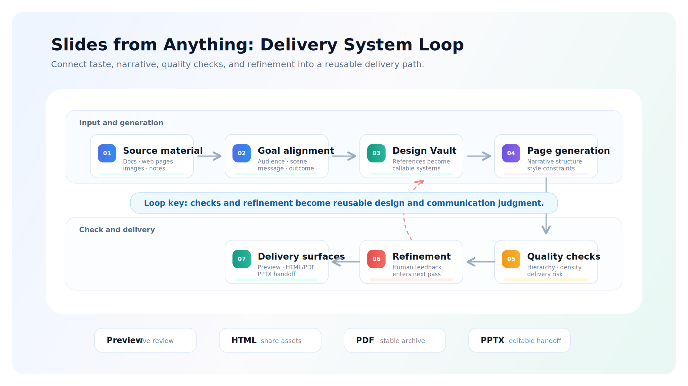
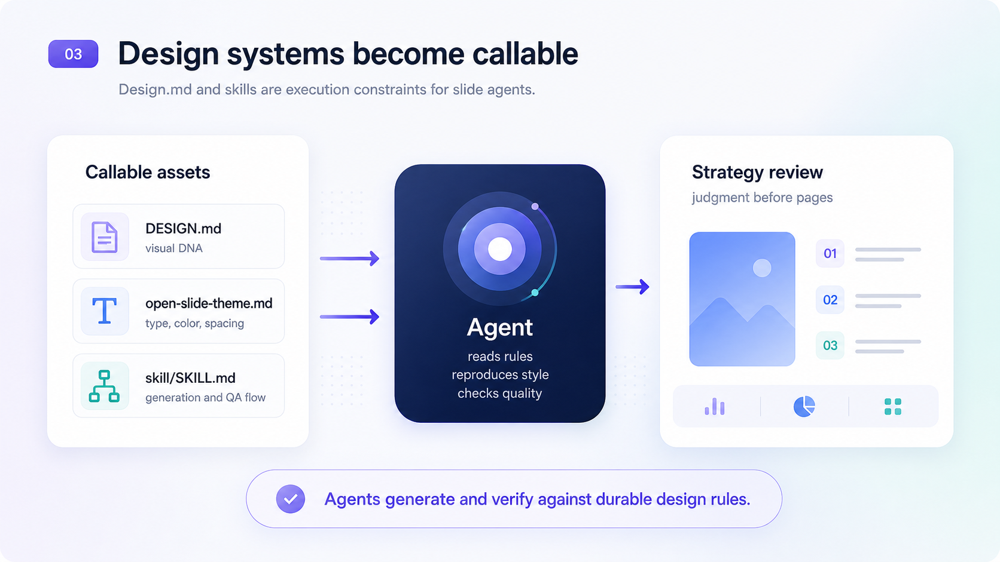
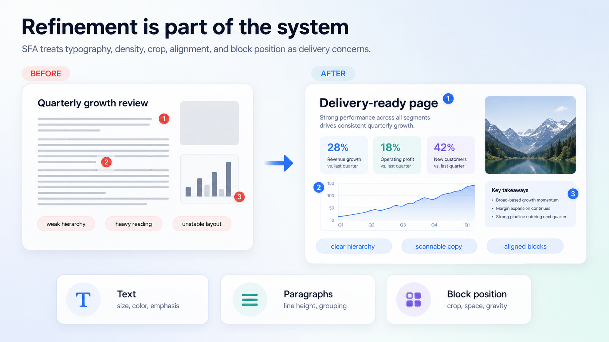
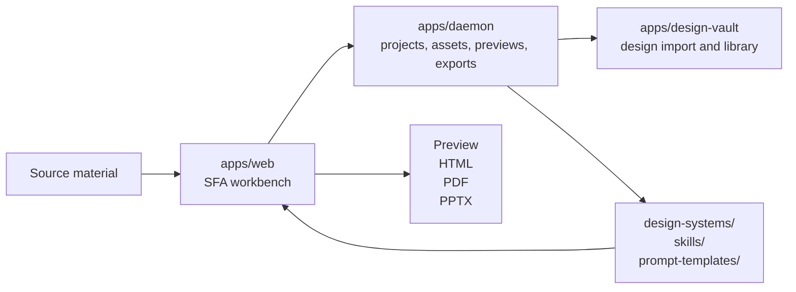

# Slides from Anything

**English** | [简体中文](README.zh-CN.md)


Slides from Anything is a local-first presentation agent workflow for turning
source material into delivery-ready decks. It connects the OpenPPT authoring
runtime, Design Vault, local agents, quality gates, direct refinement, and
multi-format export into one workspace.

It is not just another AI slide generator. SFA focuses on the hard part after a
model has produced a decent 70-80 point draft: getting the deck aligned,
inspectable, editable, and safe to send to a boss, customer, collaborator, or
meeting room.

<p align="center">
  
</p>

## Why SFA

Most AI presentation tools are judged by whether they can generate slides. Real
delivery needs more than that:

- A clear audience, message, and decision goal before pages are generated.
- A reusable design system instead of one-off prompt adjectives.
- Page-level quality checks for hierarchy, density, readability, and style fit.
- Refinement that can land on a specific block, paragraph, image, or layout.
- Export surfaces that match the job: preview, HTML, PDF, and PPTX.

SFA is deliberately scoped to that presentation delivery environment. It turns
design taste, narrative intent, local tooling, and export requirements into a
repeatable workflow.

## Delivery Workflow

<p align="center">
  
</p>

| Stage | What happens |
| --- | --- |
| Material input | Bring in documents, web pages, images, notes, or raw ideas. |
| Goal alignment | Clarify audience, context, memory points, and expected action. |
| Design Vault | Convert references into callable design systems and quality rules. |
| Page generation | Produce a deck with narrative structure and style constraints. |
| Quality check | Inspect readability, hierarchy, density, reproducibility, and delivery risk. |
| Refinement feedback | Apply human and agent feedback to concrete page blocks. |
| Multi-format delivery | Preview locally, package HTML/PDF assets, export PDF, or hand off PPTX. |

## Core Capabilities

### Design references become contracts

Design Vault is not a screenshot folder. It extracts evidence from references
and turns it into agent-readable assets such as `DESIGN.md`,
`open-slide-theme.md`, `profile.json`, `manifest.json`, `capabilities.json`, and
`skill/SKILL.md`.

<p align="center">
  
</p>

<p align="center">
  
</p>

### Refinement is part of the system

The workflow treats typography, paragraph density, alignment, image crop, and
block position as first-class delivery concerns. Small visual adjustments can be
made directly; larger narrative and style decisions can be routed back through
agents and quality gates.

<p align="center">
  
</p>

<p align="center">
  
</p>

### The integrated product is real

This repository runs the actual SFA/OpenPPT web UI and the embedded Design Vault
application. It is not a mock dashboard and not a service-only bridge.

## What Is Included

- SFA/OpenPPT web UI for creating slide decks from source material.
- Embedded Design Vault UI for importing, managing, and installing design
  systems/templates.
- Shared local runtime so templates installed in Design Vault can be selected
  inside the SFA slide workflow.
- Local daemon APIs for projects, vault templates, previews, assets, update
  checks, and export surfaces.
- Desktop and packaged-runtime scaffolding for local application distribution.
- Version/update metadata starting at `v1.0.0`.

This is a software-only open-source integration. It does not ship personal local
template libraries, private Design Vault downloads, generated projects, API
keys, logs, databases, or machine-local runtime data.

## Support The Project

If SFA is useful or interesting to you, please consider leaving a GitHub Star.
It helps more people working on presentations, AI agents, and design systems
find the project.

<p align="center">
  <a href="https://github.com/sanqiufong/slides-from-anything">
    
  </a>
</p>

## Requirements

- Node.js `24.x`
- Corepack
- pnpm `10.33.2` through Corepack
- macOS, Linux, or Windows with a shell capable of running the workspace scripts

```bash
corepack enable
pnpm install
```

## Quick Start

On macOS, the easiest path is the integrated launcher:

```bash
./start.command
```

For a terminal-only launch:

```bash
OPEN_IN_BROWSER=0 ./scripts/start-integrated.sh
```

The launcher starts both applications and cleans up stale local listeners before
binding ports:

- SFA / OpenPPT UI: `http://127.0.0.1:5173`
- Design Vault UI: `http://127.0.0.1:3217`

Press `Ctrl+C` in the launcher terminal to stop both services.

## Working With Design Vault

1. Start the integrated launcher.
2. Open `http://127.0.0.1:3217`.
3. Import a design from a URL, install a community template, or create a new
   local design system.
4. Return to the SFA UI and open the Design Vault tab.
5. Sync/select the template and create a deck.

When launched through `scripts/start-integrated.sh`, Design Vault writes runtime
template data to:

```text
.tmp/integrated/design-vault-data
```

That directory is intentionally ignored by git. Downloaded community templates
and imported local templates are user/runtime data, not source-code fixtures.

Community access is configured with:

```bash
DESIGN_VAULT_COMMUNITY_BASE_URL=https://vault.aassistant.xyz
```

Model-backed imports can be configured with variables documented in
`apps/design-vault/.env.example`, including `DESIGN_VAULT_MODEL_BASE_URL`,
`DESIGN_VAULT_MODEL_API_KEY`, and `DESIGN_VAULT_MODEL_NAME`. Do not commit real
credentials.

## Development

The root workspace intentionally keeps lifecycle commands narrow. Use
`pnpm tools-dev` for SFA/OpenPPT development and the integrated launcher when
you need Design Vault connected at the same time.

```bash
pnpm tools-dev run web --daemon-port 17456 --web-port 5173
pnpm tools-dev status --json
pnpm tools-dev logs --json
pnpm tools-dev stop
```

Run validation before publishing changes:

```bash
pnpm guard
pnpm typecheck
pnpm --filter @open-design/web test
pnpm --filter @open-design/daemon test
pnpm --filter design-vault build
```

## Data and Privacy Boundaries

The repository is prepared for public release with a strict split between
software assets and local/private data.

Ignored local/runtime data includes:

- `.tmp/`
- `.od/`
- `apps/design-vault/data/*` except `.gitkeep`
- `skills/dv-*`
- `design-systems/dv-*`
- local `.env` files
- generated logs, databases, project artifacts, and downloaded template bundles

By default, SFA does not import templates from a neighboring `../design-vault`
checkout. That legacy behavior only turns on if you explicitly set:

```bash
OPENPPT_VAULT_IMPORT_AUTODISCOVER=1
```

Framework images and UI assets required for the software itself should stay in
the source tree. Personal content, private template payloads, and credentials
should stay in ignored runtime directories.

## Architecture At A Glance



## Repository Layout

```text
apps/web            SFA/OpenPPT Next.js web runtime
apps/daemon         local daemon APIs, vault bridge, project/runtime services
apps/design-vault   embedded Design Vault application
apps/desktop        Electron desktop shell
apps/packaged       packaged runtime entry
packages/contracts  shared TypeScript contracts
packages/sidecar*   sidecar protocol/runtime packages
tools/dev           local development lifecycle control plane
tools/pack          packaged build/start/stop tooling
skills/             source-controlled slide/design skills
design-systems/     source-controlled design-system descriptors
prompt-templates/   prompt and generation templates
releases/           update-channel metadata
docs/               architecture and operational documentation
```

## Documentation

- `QUICKSTART.md`
- `CONTRIBUTING.md`
- `docs/architecture.md`
- `docs/openppt-architecture-notes.md`
- `docs/design-vault-style-output-requirements.md`
- `docs/update-service.md`

Read `AGENTS.md` before changing repository structure or lifecycle commands.
Package-level details live in nested `AGENTS.md` files under `apps/`,
`packages/`, and `tools/`.

## License

Apache-2.0. See `LICENSE`.
