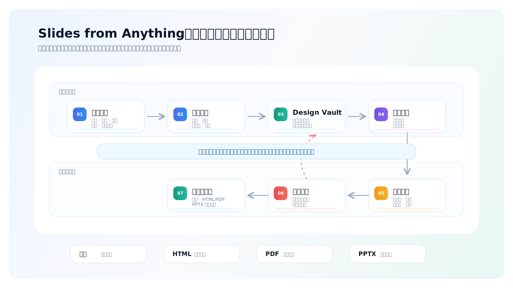
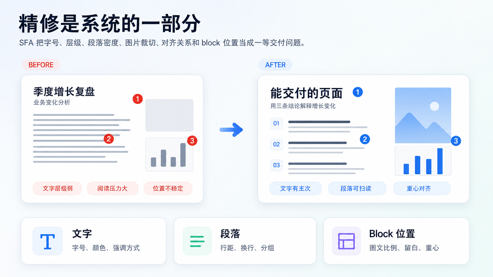
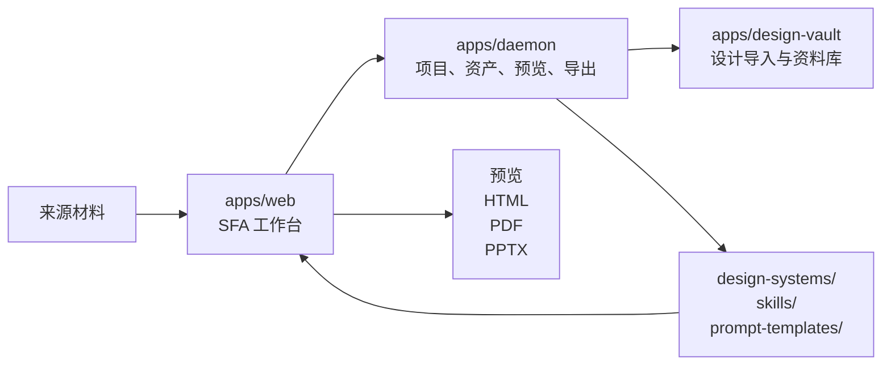

# Slides from Anything

[English](README.md) | **简体中文**


Slides from Anything 是一个本地优先的演示 Agent 工作流，用来把文档、网页、图片、笔记或想法推进到可交付的 slide deck。它把 OpenPPT 创作运行时、Design Vault、本地 Agent、质量门、直接精修和多格式导出整合到同一个工作台里。

它不只是又一个 AI PPT 生成器。SFA 关注的是模型已经生成 70-80 分初稿之后更难的部分：让这套 deck 目标清楚、设计可复用、页面可检查、局部可修改，并且真的能发给老板、客户、协作方或会议现场使用。

<p align="center">
  
</p>

## 为什么是 SFA

大多数 AI PPT 工具会先回答“能不能生成页面”。但真实交付需要更多东西：

- 生成前先对齐受众、表达目标、记忆点和期望行动。
- 把审美参考沉淀成可复用的设计系统，而不是一次性 prompt。
- 对页面层级、信息密度、可读性和风格复现度做质量检查。
- 精修反馈能定位到具体 block、段落、图片或布局，而不是整套重写。
- 根据真实场景选择出口：本地预览、HTML、PDF 或 PPTX。

SFA 刻意收敛在“演示文稿交付”这个具体环境里。它把设计判断、叙事目标、本地工具链和导出要求，变成一条可以反复运行的工作流。

## 交付工作流

<p align="center">
  
</p>

| 阶段 | 做什么 |
| --- | --- |
| 材料输入 | 接收文档、网页、图片、笔记或原始想法。 |
| 目标对齐 | 明确受众、场景、记忆点和期望行动。 |
| Design Vault | 把设计参考变成可调用的设计系统和质量规则。 |
| 页面生成 | 在叙事结构和视觉约束下生成 deck。 |
| 质量检查 | 检查可读性、层级、密度、复现度和交付风险。 |
| 精修反馈 | 将人类和 Agent 反馈落到具体页面 block。 |
| 多格式交付 | 本地预览、HTML/PDF 资产包、PDF 留档或 PPTX 继续编辑。 |

## 核心能力

### 设计参考会变成契约

Design Vault 不是截图收藏夹。它会从设计参考中提取证据，并沉淀成 Agent 可读取的资产，例如 `DESIGN.md`、`open-slide-theme.md`、`profile.json`、`manifest.json`、`capabilities.json` 和 `skill/SKILL.md`。

<p align="center">
  
</p>

<p align="center">
  
</p>

### 精修是系统的一部分

SFA 把字号、层级、段落密度、图片裁切、对齐关系和 block 位置当成一等交付问题。小的视觉调整可以直接操作；更复杂的叙事和风格判断可以交给 Agent 与质量门继续迭代。

<p align="center">
  
</p>

<p align="center">
  
</p>

### 跑起来的是实际产品

这个仓库运行的是真实 SFA/OpenPPT Web UI 和内嵌 Design Vault 应用。它不是临时写出来的 mock dashboard，也不是只提供服务接口的后端桥接。

## 包含什么

- SFA/OpenPPT Web UI，用于从来源材料创建 slide deck。
- 内嵌 Design Vault UI，用于导入、管理、安装设计系统和模板。
- 共享本地运行时，让 Design Vault 中安装的模板可以在 SFA 幻灯片流程里选择使用。
- 本地 daemon API，负责项目、Vault 模板、预览、资产、更新检查和导出 surface。
- Desktop 与 packaged runtime 脚手架，用于本地应用分发。
- 从 `v1.0.0` 开始的版本与更新元数据。

这个仓库是面向开源发布的软件集成项目。它不包含个人本地模板库、私有 Design Vault 下载内容、生成项目、API Key、日志、数据库或其他机器本地运行数据。

## 支持项目

如果 SFA 对你有启发，欢迎在 GitHub 上给这个项目留一个 Star。它会帮助更多做 PPT、AI Agent 和设计系统的人看到这个方向。

<p align="center">
  <a href="https://github.com/sanqiufong/slides-from-anything">
    
  </a>
</p>

## 环境要求

如果使用便携发布包，用户不需要安装 Node.js、Corepack 或 pnpm。解压后双击
`start.command` 即可，发布包会使用自带的 `runtime/node` 和已经打包好的
`node_modules`。

如果从源码仓库运行，需要：

- Node.js `24.x`
- Corepack
- 通过 Corepack 使用 pnpm `10.33.2`
- macOS、Linux 或 Windows，并具备能运行 workspace 脚本的 shell 环境

```bash
corepack enable
pnpm install
```

## 构建便携发布包

维护者可以生成给非开发用户使用的自带环境包：

```bash
pnpm tools-pack integrated build
```

产物会写入：

```text
releases/integrated/Slides-from-Anything-portable
releases/integrated/Slides-from-Anything-portable.zip
```

这个包会携带 Node 24 runtime、当前 workspace 依赖和双击启动入口；启动时会跳过
`pnpm install`，不依赖用户机器上的全局 Node/pnpm。

## 快速启动

在 macOS 上，最简单的方式是使用集成启动器：

```bash
./start.command
# 或
./启动集成项目.command
```

如果只想在终端里启动：

```bash
OPEN_IN_BROWSER=0 ./scripts/start-integrated.sh
```

启动器会同时启动两个真实应用，并在绑定端口前清理旧的本地监听进程：

- SFA / OpenPPT UI：`http://127.0.0.1:5173`
- Design Vault UI：`http://127.0.0.1:3217`

在启动器终端里按 `Ctrl+C` 可以同时停止两个服务。

## 使用 Design Vault

1. 启动集成项目。
2. 打开 `http://127.0.0.1:3217`。
3. 从 URL 导入设计、安装社区模板，或创建新的本地设计系统。
4. 回到 SFA UI，进入 Design Vault 标签页。
5. 同步/选择模板，然后创建 deck。

通过 `scripts/start-integrated.sh` 启动时，Design Vault 会把运行时模板数据写到：

```text
.tmp/integrated/design-vault-data
```

这个目录会被 git 忽略。下载的社区模板、导入的本地模板都属于用户运行数据，不属于源码 fixtures。

社区服务地址通过下面的环境变量配置：

```bash
DESIGN_VAULT_COMMUNITY_BASE_URL=https://vault.aassistant.xyz
```

如果要启用模型辅助导入，可以参考 `apps/design-vault/.env.example` 中的变量，例如 `DESIGN_VAULT_MODEL_BASE_URL`、`DESIGN_VAULT_MODEL_API_KEY` 和 `DESIGN_VAULT_MODEL_NAME`。不要提交真实凭证。

## 日常开发

根目录的生命周期命令刻意保持很窄。开发 SFA/OpenPPT 时使用 `pnpm tools-dev`；需要 Design Vault 一起接入时，使用集成启动器。

```bash
pnpm tools-dev run web --daemon-port 17456 --web-port 5173
pnpm tools-dev status --json
pnpm tools-dev logs --json
pnpm tools-dev stop
```

发布或提交前建议运行：

```bash
pnpm guard
pnpm typecheck
pnpm --filter @open-design/web test
pnpm --filter @open-design/daemon test
pnpm --filter design-vault build
```

## 数据与隐私边界

这个仓库按公开发布来整理，软件资产与本地/私有数据必须严格分开。

以下本地运行数据会被忽略：

- `.tmp/`
- `.od/`
- `apps/design-vault/data/*`，但保留 `.gitkeep`
- `skills/dv-*`
- `design-systems/dv-*`
- 本地 `.env` 文件
- 生成日志、数据库、项目产物与下载模板包

默认情况下，SFA 不会从相邻的 `../design-vault` checkout 自动导入模板。只有显式设置下面的变量时，旧的自动发现行为才会开启：

```bash
OPENPPT_VAULT_IMPORT_AUTODISCOVER=1
```

软件框架本身需要的图片和 UI 资产应该保留在源码里。个人内容、私有模板包和凭证应该留在被忽略的运行时目录中。

## 架构速览



## 仓库结构

```text
apps/web            SFA/OpenPPT Next.js Web runtime
apps/daemon         本地 daemon API、Vault bridge、项目/运行时服务
apps/design-vault   内嵌 Design Vault 应用
apps/desktop        Electron 桌面壳
apps/packaged       packaged runtime 入口
packages/contracts  共享 TypeScript contracts
packages/sidecar*   sidecar 协议与运行时包
tools/dev           本地开发生命周期控制面
tools/pack          打包构建、启动、停止与日志工具
skills/             源码管理的 slide/design skills
design-systems/     源码管理的 design-system 描述
prompt-templates/   prompt 与生成模板
releases/           更新通道元数据
docs/               架构与运行文档
```

## 文档

- `QUICKSTART.md`
- `CONTRIBUTING.md`
- `docs/architecture.md`
- `docs/openppt-architecture-notes.md`
- `docs/design-vault-style-output-requirements.md`
- `docs/update-service.md`

修改仓库结构或生命周期命令前，请先阅读 `AGENTS.md`。`apps/`、`packages/`、`tools/` 下面还有各自的嵌套 `AGENTS.md`，用于说明模块级边界。

## 许可证

Apache-2.0。详见 `LICENSE`。
